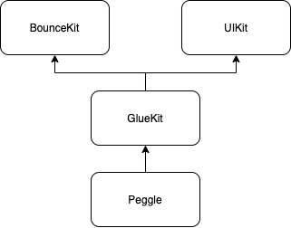
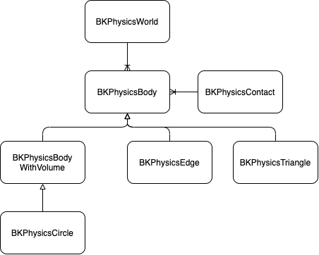
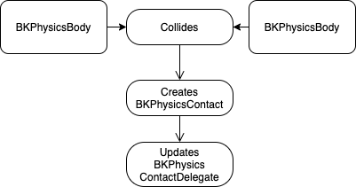
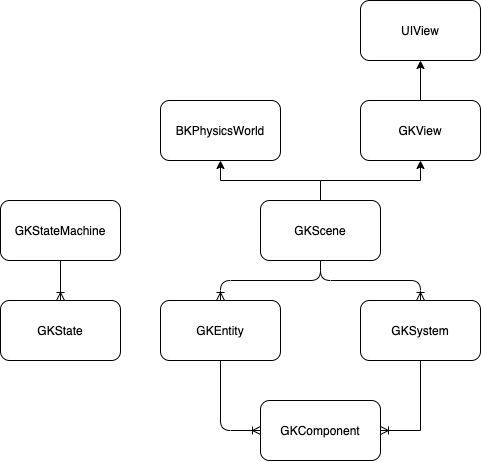
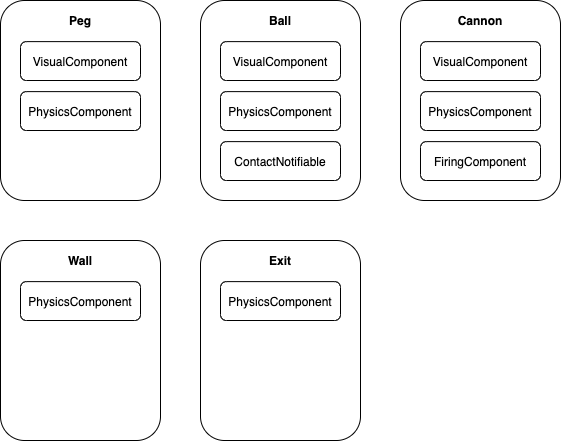

# CS3217 Problem Set 4

**Name:** Koh Zheng Qiang Shawn

**Matric No:** A0185892L

## Tips
1. CS3217's docs is at https://cs3217.netlify.com. Do visit the docs often, as
   it contains all things relevant to CS3217.
2. A Swiftlint configuration file is provided for you. It is recommended for you
   to use Swiftlint and follow this configuration. We opted in all rules and
   then slowly removed some rules we found unwieldy; as such, if you discover
   any rule that you think should be added/removed, do notify the teaching staff
   and we will consider changing it!

   In addition, keep in mind that, ultimately, this tool is only a guideline;
   some exceptions may be made as long as code quality is not compromised.
3. Do not burn out. Have fun!

## Dev Guide
https://github.com/SanderMertens/ecs-faq

### Overview

The game Stress is built on top of 3 key pillars.
1. BounceKit: A 2D rigid body simulation library.
2. [UIKit](https://developer.apple.com/documentation/uikit): A graphical, event-driven user interface framework.
3. GlueKit: A 2D game engine based on the entity component system framework. It leverages UIKit to render, and BounceKit to simulate its physics.

### BounceKit

BounceKit is heavily inspired by [SpriteKit](https://developer.apple.com/documentation/spritekit)'s physics simulation.

In BounceKit, a `BKPhysicsWorld` represents a world that the physics simulation is run in.
It exposes the ability to configure and query the physics system.
For instance, you can modify the gravity and air density of the world.

A `BKPhysicsBody` represents an object in the physics simulation.
BounceKit supports two kinds of physics bodies, volume-based bodies and edge-based bodies.

An `edge-based` body does not have mass or volume and is unaffected by forces or impulses in the system.
Edge-based bodies are used to represent volumeless boundaries or hollow spaces in your physics simulation.

In contrast, `volume-based` bodies are used to represent objects with mass and volume.
A volume-based body can either be `dynamic` or `static`.
A dynamic volume simulates a physical object with volume and mass that can be affected by forces and collisions in the system.
A static volume is similar to a dynamic volume, but it is unaffected by forces and collisions.
However, because it still has volume, other objects can bounce off it or interact with it.

BounceKit also supports collision detection between bodies.
When two bodies collide, A `BKPhysicsContact` is created, and the physic world's contact delegate, `BKPhysicsContactDelegate`, is informed.

### GlueKit

GlueKit is heavily inspired by [SpriteKit](https://developer.apple.com/documentation/spritekit) and [GameplayKit](https://developer.apple.com/documentation/gameplaykit).

It serves as the 'glue' between BounceKit, the physics simulation library, and UIKit, to provide a convenient framework for building 2D games.

It utilises an [entity component system architecture](https://en.wikipedia.org/wiki/Entity_component_system)

In GlueKit, A `GKView` is a `UIView` subclass that controls which `GKScene` is currently being rendered on the view.

A `GKScene` is a managed scene of `GKEntity` entities.   
When a `GKScene` is presented by a `GKView`, the `GKView` is updated every time the device's screen refreshes through [CADisplayLink](https://developer.apple.com/documentation/quartzcore/cadisplaylink)
It also manages a `BKPhysicsWorld`, and advances its simulation multiple times (configurable setting) per screen refresh.
The `GKScene` also contains `GKComponentSystem` that can be used to drive updates to the respective `GKComponent`s.

### Peggle

Peggle is built on top of GlueKit.

Each entity in Peggle comprises of components such as:
* `VisualComponent`: Renders the entity.
* `PhysicsComponent`: Registers the entity in the physics simulation.
* `CannonControlComponent`: Allows the entity to fire projectiles.
* `CollisionComponent`: Registers the entity to listen for collision events e.g. between the ball and other entities like Pegs and Exits.

### Set up instructions
1. Clone this repo
2. Install CocoaPods
3. In your terminal, cd into the repo
4. In your terminal, run pod install
5. Open the Bounce.xcworkspace file

## Rules of the Game
Please write the rules of your game here. This section should include the
following sub-sections. You can keep the heading format here, and you can add
more headings to explain the rules of your game in a structured manner.
Alternatively, you can rewrite this section in your own style. You may also
write this section in a new file entirely, if you wish.

### Cannon Direction
Pan horizontally on the screen to control where the cannon points to.

### Cannon Firing
Tap on the screen to fire the cannon. It will shoot towards where it is currently facing.

### Win and Lose Conditions
You start off each round with 10 shots.

You win when all the objective pegs (orange color) in the game are cleared.

You lose when you run out of shots before all the objectives are cleared.

### Bonus ammo
When the ball lands in the bucket, you gain an additional shot.

### Powerups
When the ball hits a green peg, you enable the `Space Blast` powerup. All the pegs within the radius of the green circle surrounding the ball will become lighted up.

When the ball hits a red peg, you enable the `Spooky Ball` powerup. When the ball exits the stage, it reappears at the top of the gameplay area at the same x-axis position.

## Level Designer Additional Features

### Peg Rotation
Please explain how the player rotates the triangular pegs.

### Peg Resizing
You can resize the peg by clicking on the Size +/- stepper.

This affects the size of the pegs you create thereafter.

If you want to resize an existing peg, delete it, adjust the size and then create a new peg where it was.

## Bells and Whistles
### Entity Component System

### Level Selector Gallery View
The gallery view does not use a screenshot shortcut.

## Tests

### BounceKit

- BKPhysicsBody.swift
    - init(isResting:)
        - When passed with isResting = false, it should initialise the property isResting set as false.
        - When passed with isResting = true, it should initialise the property isResting set as true.
    - == (lhs:rhs:)
        - When passed with the same BKPhysicsBody instance, it should return false.
        - When passed with two different BKPhysicsBody instance, it should return false
    - BKPhysicsBodyWithVolume.swift
        - applyForce(_:)
            - When passed with CGVector(dx: 0, dy: 0), it should not change the physics body's velocity.
            - When passed with CGVector(dx: 1, dy: -1), it should change the physics body's velocity from (A, B) to (A + 1, B - 1)
    - BKPhysicsEdge.swift
        - init(from:to:)
        - When passed with from = 0,0, to = 0,0, it should initialise the property from = 0,0 and to = 0,0 
            - When passed with from = -1,1, to = 1,-1, it should initialise the property from = 1,1 and to = 1,-1.
    - BKPhysicsCircle.swift
        - init method
            - When passed with center and radius, it should initialise their properties with the passed values. It should also initialise their mass, dragCoefficient, restitution, velocity with their defaults as specified in BKSettings.swift. It should also initialise the velocity to 0,0, isDynamic as true, and isResting as false.
           - When passed with center and radius, as well as any of the optional properties mentioned above, it should initialise their properties with the passed values. An optional property with a different passed value from the default should initialise its property with the passed value, and not its default value.
       - intersects(with:)
        - When called by a BKPhysicsCircle with center 0,0 and radius 5, and passed with a BKPhysicsCircle with center 0,0 and radius 5, it should return true  
        - When called by a BKPhysicsCircle with center 0,0 and radius 5, and passed with a BKPhysicsCircle with center 0,10 and radius 5, it should return false
        - When called by a BKPhysicsCircle with center 0,0 and radius 5, and passed with a BKPhysicsCircle with center 0,5 and radius 5, it should return true
        - When called by a BKPhysicsCircle with center 0,0 and radius 5, and passed with a BKPhysicsEdge with from -10,-10 and to 10,10, it should return true
        - When called by a BKPhysicsCircle with center 0,0 and radius 5, and passed with a BKPhysicsEdge with from 0,-10 and to 0,10, it should return false
    - computePositionWhenContacting(with:)
        - When called by a BKPhysicsCircle with center 0,0, radius 5, velocity 1,0 and passed with a BKPhysicsEdge with from 4, -10 and to 4, 10, it should return -1,0 
        - When called by a BKPhysicsCircle with center 0,0, radius 5, velocity 1,0 and passed with a BKPhysicsEdge with from 5, -10 and to 5, 10, it should return nil
        - When called by a BKPhysicsCircle with center 0,0, radius 5, velocity 1,0 and passed with a BKPhysicsCircle with center 10,0 and radius 5, it should return nil
        - When called by a BKPhysicsCircle with center 0,0, radius 5, velocity 1,0 and passed with a BKPhysicsCircle with center 9,0 and radius 5, it should return -1, 0
    - computeContact(with:)
        - When called by a BKPhysicsCircle with center 0,0, radius 5, velocity 1,0 and passed with a BKPhysicsEdge with from 6, -10 and to 6, 10, it should return 6,0
        - When called by a BKPhysicsCircle with center 0,0, radius 5, velocity 1,0 and passed with a BKPhysicsEdge with from -10, -10 and to 10, -10, it should return nil
        - When called by a BKPhysicsCircle with center 0,0, radius 5, velocity 1,0 and passed with a BKPhysicsCircle with center 10,0 and radius 5 and velocity -1,0, it should return nil
        - When called by a BKPhysicsCircle with center 0,0, radius 5, velocity 1,0 and passed with a BKPhysicsCircle with center 9,0 and radius 5 and velocity 0, 0, it should return -1, 0
    - BKLineProtocol
        - When called by a BKLine with from 0,0, to 0,10
    - BKPhysicsWorld.swift
        - init(size:)
            - When initialised with CGSize(width: 100, height: 100), it should initialise the variable size with the passed value.
        - addBody(_:)
            - When passed with a BKPhysicsBody, should update the bodies variable such that bodies.length would be incremented by one, and the passed body would be appended to the end of bodies.
        - removeBody(_:)
            - When passed with a BKPhysicsBody that is part of the physics world, should remove and return the passed body.
            - When passed with a BKPhysicsBody that is not part of the physics world, should return nil.
        - simulate(timestep:)
            - When called by a BKPhysicsWorld with a BKPhysicsCircle with center 0,0 and radius 5, and passed with a timestep of 1.0, it should update the center of the BKPhysicsCircle and its velocity.

### GlueKit

- GKView.swift
    - init(coder:)
        - When initialised, should set the isUserInteractionEnabled property to true.
    - presentScene(_:)
        - When passed with a GKScene, should update the scene's view property to self. The scene's update(timestep:updateFrequency:) method should also be called every frame.
        - When the GKView is currently presenting a scene, and passed with a new GKScene, should remove all the subviews in the previous scene and stop updating the previous scene. Should load the new scene and start updating the new scene.
- GKScene.swift
    - init(size:)
        - When passed with a size of CGSize(width: 100, height:100), should initialise the size property as the passed value. Should also initialise the physicsWorld and physicsWorld's contact delegate.
    - addEntity(_:)
        - When passed with a GKEntity, should append it to the end of the entities array, update the entity's scene to self, and register the entity's components, if any, inside the GKScene's component systems.
    - removeEntity(_:)
        - When passed with a GKEntity that does not currently belong to the GKScene, should not do anything i.e. not add / remove any entities.
        - When passed with a GKEntity that belongs to the GKScene, should remove the entity from the GKScene, and remove all components from the component systems that are found in the removed entity.
        - entities(ofType:)
            - When called on a GKScene with no entities, should return an empty array.
            - When called on a GKScene with entities, should return an array of entities that are of the provided type.
        - entity(withPhysicsBody:)
            - When called on a GKScene with no entities, should return nil.
            - When called on a GKScene with an entity that contains the specified physics body, should return that entity.
    - GKEntity.swift
    - init()
        - Should initialise an entity with an empty components array and a nil scene.
    - addComponent(_:))
        - Should add the provided component to the entity. Components array should contain the provided component.
    - removeComponent(_:)
        - When called on an entity with no components, should not do anything.
        - When called on an entity with components but without the provided component, should not do anything.
        - When called on an entity with the specified component, should remove the specified component.
    - component(ofType:)
        - When called on an entity with no components, should return nil.
        - When called on an entity with components but with none of the specified type, should return nil.
        - When called on an entity with component(s) of the specified type, should return the first component of the specified type that was added to the entity.
        
### Stress Integration Tests
- On app launch, should display the background image, cannon and pegs from the stubbed level.
- When you pan the screen, it should rotate the cannon.
- When you pan the screen to the top left, or top right, of the device, the cannon should rotate up till a certain point, based on the current `Settings.cannonShootingAngleConstraint` setting.
- While panning, when you let go of your screen, it should fire the cannon towards where the cannon is currently pointing towards, not necessarily where your finger is.
- When the ball fired from the cannon hits a peg, the peg should glow.
- When the ball hits the bottom of the screen, it should disappear, exiting the level.
- When the ball hits the bottom of the screen, after 0.8 seconds, the pegs that were hit (those glowing) should disappear. They should fade while disappearing.

- When the ball hits a peg, it should bounce off towards the same direction it was approaching the peg from.
- When the ball hits a wall (left, top, right), it should bounce off, towards the same direction it was approaching the peg from.
- When the ball hits a peg perfectly vertically, it should bounce multiple times on the same peg, and on each bounce, slow down until it eventually rests.
- When another ball hits a ball that is resting, it should cause the resting ball to stop resting and be pushed away.

- When a ball collides with another ball, both balls should collide and bounce away from each other.

## Written Answers

### Reflecting on your Design
> Now that you have integrated the previous parts, comment on your architecture
> in problem sets 2 and 3. Here are some guiding questions:
> - do you think you have designed your code in the previous problem sets well
>   enough?
> - is there any technical debt that you need to clean in this problem set?
> - if you were to redo the entire application, is there anything you would
>   have done differently?

#### On the importance of picking a good architecture

When I first started out on the problem sets, I had a very limited knowledge of architecture design patterns - I really only knew about MVC.

So for PS2, I went all in on MVC and thought that I had a pretty robust architecture.

Boy was I wrong haha.

As I embarked on PS3, I realised that the MVC architecture was starting to become really painful to use. I constantly had to rewrite my classes and migrate code from my subclasses to my superclass whenever another subclass required a same-same but different feature.

So I sought out a better way, and discovered ECS after reading about how games are usually developed.

At first impression, it felt like a silver bullet. Aha! I thought adopting it would help me breeze through PS4 since ECS is extensible by design.

Or so I thought...

#### Don't blindly copy a library

As I shopped around for a good ECS framework to base my design off, I came upon Unity ECS and GameplayKit.

I thought that Unity's design would be overkill since I mistakenly had the impression that Unity was meant for large games.

I went with GameplayKit's design because its designed to integrate well with SpriteKit, Apple's 2D game framework, and thought hey perfect! We are building a 2D game on iOS!

This was a ***monstrous mistake***.

I built GlueKit entirely based off GameplayKit's API specs, then built Peggle around it.

It was a constant exercise in frustration as it was really hard to tell where exactly the updates were coming from - in GameplayKit, a component can be updated via its entity, the component itself or a ComponentSystem.

Turns out, GameplayKit is actually a half-assed ECS framework. Heck, its not even ECS. It's more like EC with their "S" being ComponentSystems which are almost nothing like Systems!

I ended up having to scrap all my work with GameplayKit and Peggle, and restarted with a design based off Unity's ECS.

#### Technical Debt: Unity ECS Archetype

By this point, it was getting really close to the deadline and hence I took a few shortcuts in implementing Unity's ECS.

The most significant of which would be not implementing their Archetype architecture.

Their Archetype architecture enables O(1) access to retrieving the System's entites to iterate, by registering every Entity to an Archetype that is conceptually a set of its component types.

Instead, I took the technical debt of having all my Systems iterate every entity - O(N) - to filter out those that had components required by the System.

I did this to save time, and that there are very little entities in the context of Peggle.

Had I have the time to implement the Archetype, I would have done it based on the following design (which excludes their Chunks)

1. In a GKScene, register component types
the goal is to allocate a unique index to each component type
componentA = 1, componentB = 2, componentC = 3, …

2. Create entities with its components defined.
e.g. entity with componentC, componentA
store the components in an array that matches the ordering in #1 i.e. [componentA, nil, componentC]

check if the GKScene has ever defined such an archetype {componentA, componentC}, and if not, add it to the list of archetypes

add the component array into the archetype {componentA, componentC}

3. In a system, when you query for the entities to iterate, you must specify the component types.

iterate through the list of archetypes to find all archetypes that contains the component types (can possibly use set intersection here)
iterate through each archetype to get the entities needed.
BUT instead of returning an array of entities, return an ordered array of the specified components (based on their ordering in #1)

What happens when an entity adds a component?

remove the component array from the current archetype
add the component into the entity’s component array
create the archetype if it does not exist in the GKScene
store the component array into the archetype,

vice versa for removing a component

—
when removing a component array from an archetype, use the trick of replacing the element at the specified index with the last element and nil the last element to avoid O(N) deletion
